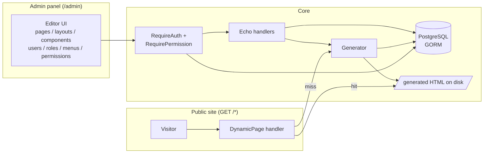
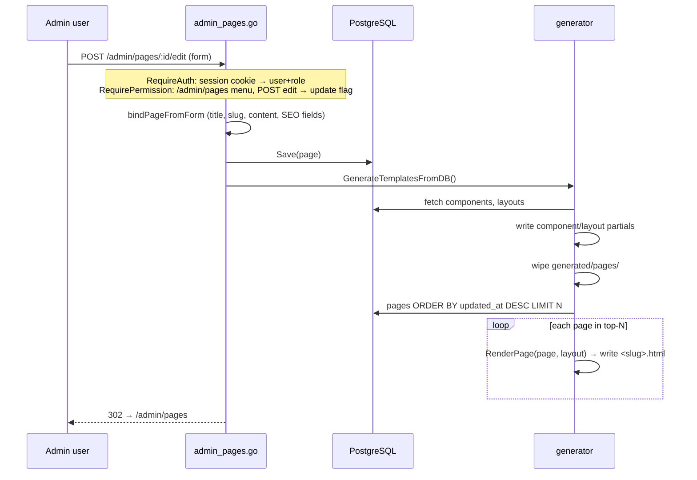
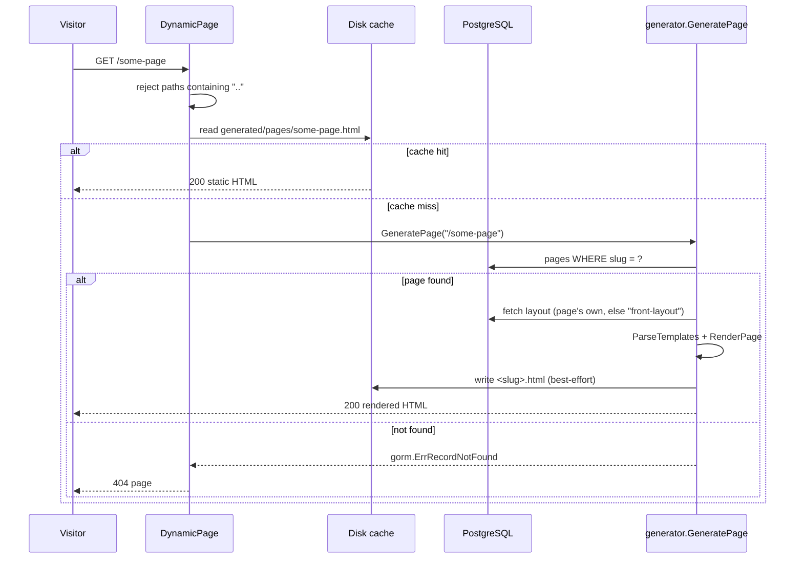

# cms-go

A lightweight CMS built in Go that works like a **static site generator with an admin panel**. Content (pages, layouts, components) lives in PostgreSQL and is edited through a server-rendered admin UI. The public site is served as pre-rendered HTML files from disk — visitors never trigger database queries or template execution, except on a cache miss for a page that hasn't been rendered yet.

## Tech stack

| Concern    | Choice |
|------------|--------|
| Language   | Go 1.20 |
| HTTP       | [Echo v4](https://echo.labstack.com) |
| Database   | PostgreSQL via [GORM](https://gorm.io) (schema managed by `AutoMigrate`, no migration files) |
| Templating | Go `html/template` |
| Admin UI   | Server-rendered HTML + Tailwind (CDN) + Ace editor, vanilla JS |
| Config     | `.env` via `godotenv` |

## Running

Prerequisites: Go 1.20+, a running PostgreSQL instance.

```bash
# 1. Create the database
createdb go-cms

# 2. Configure (see table below)
cp .env .env.local   # or edit .env directly

# 3. (Optional) seed demo data — layouts, components, sample pages
psql go-cms < cms_go.sql

# 4. Run
go run .
```

The server starts on **:8080**:

- Admin panel: `http://localhost:8080/admin` (login required — see [Authentication & RBAC](#authentication--rbac))
- Public site: `http://localhost:8080/<slug>`

On boot the app auto-migrates the schema (`Page`, `Layout`, `Menu`, `Component`, `User`, `Role`, `Permission`, `Session`), seeds the auth tables if empty (superadmin role + admin user + menus + permissions), and pre-renders the hot set of pages to disk (see [Generator](#how-the-page-generator-works)).

## Configuration (`.env`)

| Variable | Example | Purpose |
|----------|---------|---------|
| `DATABASE_URL` | `postgresql://user@localhost:5432/go-cms` | Postgres DSN. Falls back to a local default if unset. |
| `SITE_URL` | `https://example.com` | Public base URL, used to build absolute canonical / `og:url` SEO tags. No trailing slash needed (it's trimmed). |
| `GENERATE_PAGE_LIMIT` | `50` | How many latest-updated pages to pre-render in bulk on boot / after admin edits. Everything else renders lazily on first request. Default 50. |
| `ADMIN_EMAIL` | `admin@example.com` | Email for the first superadmin, seeded on first boot when the users table is empty. |
| `ADMIN_PASSWORD` | *(set your own!)* | Password for the seeded superadmin. Defaults to `admin123` with a loud log warning — change it before deploying. |
| `DIR_NAME` | `cms-go` | Project directory name, used by `config.RootPath()` to resolve file paths. |
| `APP_KEY`, `APP_NAME` | — | Reserved app identity values. |

## Content model

Four tables, defined as GORM structs in [internal/models/model.go](internal/models/model.go):

- **Page** — `title`, `slug` (unique, stored with leading slash e.g. `/about-us`), `type` (`page`/`post` = JSON page-builder content, `html` = raw HTML), `content`, `layout_id`, plus a full **SEO block**: meta title/description, canonical URL, focus keyword, robots noindex/nofollow, Open Graph and Twitter Card fields.
- **Layout** — a full HTML document template (Go template syntax, including `<head>`) plus a JSON `structure` of rows/columns/components. A page renders *inside* its layout; the layout named `front-layout` is the default.
- **Component** — a named, reusable template fragment (e.g. `header`, `footer`, `content`) with a JSON props schema. Referenced from layout/page structures as `{"type": "header", "props": {...}}`.
- **Menu** — placeholder for navigation (not yet wired up).

Layout templates receive per-page data: `{{.Title}}`, `{{.page}}` (the full Page struct), `{{.rows}}`, and `{{.seoHead}}` — a pre-built, escaped block of `<title>`, meta description, canonical, robots, OG and Twitter tags with WordPress-style fallbacks (built by [internal/generator/seo.go](internal/generator/seo.go)).

## Authentication & RBAC

The admin panel is protected by session auth + role-based access control, modeled as **users → roles → permissions → menus** ([internal/models/auth.go](internal/models/auth.go), [internal/auth/](internal/auth/)):

- **User** — profile fields + bcrypt password hash + `role_id` + status. Soft-deleted.
- **Role** — a named group (`superadmin` is seeded and bypasses all permission checks so you can never lock yourself out).
- **Menu** — one admin section: name, `path` (e.g. `/admin/pages`), icon, parent/order for the sidebar, status.
- **Permission** — one row per role × menu with four flags: `create`, `read`, `update`, `delete`.
- **Session** — DB-backed login sessions; the browser holds a random 64-hex token in an `HttpOnly` cookie (`cms_session`, 7-day TTL, `Secure` when `SITE_URL` is https).

**How a request is authorized** (two middleware on the `/admin` group, [internal/auth/middleware.go](internal/auth/middleware.go)):

1. `RequireAuth` — resolves the session cookie to an active user (role preloaded) or redirects to `/admin/login`. Also loads the role's readable menus for the sidebar.
2. `RequirePermission` — matches the request path to a menu by **longest path prefix** (`/admin/pages/5/edit` → `/admin/pages`), then checks the flag for the verb: GET needs `read`; POST needs `delete` if the path ends `/delete`, `create` if it ends `/new`, otherwise `update`. No match or no flag → 403.

**The sidebar is data, not markup**: it renders the menus the logged-in role can *read*, ordered by `list_order`, nested by `parent_id`, with the current section highlighted. Grant a role read on a menu and it appears; revoke and it disappears.

**Management UIs** (all under the same RBAC): `/admin/users`, `/admin/roles`, `/admin/menus`, and `/admin/permissions` — a per-role matrix editor showing every menu × C/R/U/D checkboxes, saved in one click.

**Login hardening**: `POST /admin/login` is protected by **CSRF** (double-submit cookie, token read from the `_csrf` form field) and **per-IP rate limiting** (burst of 5 attempts, then ~1 per 12 seconds; over-limit requests get `429`). The CSRF cookie is scoped to `/` and intentionally not `HttpOnly` so a CMS-built login page can read it from JS.

**Two login surfaces, one endpoint** — both submit to `POST /admin/login`:

1. **Built-in admin login** (`GET /admin/login`) — the fallback template [internal/views/admin/login-admin.html](internal/views/admin/login-admin.html), always available. It carries the CSRF token in a hidden `_csrf` field automatically; failed logins re-render it with the error message.
2. **Public `/login` CMS page** (optional) — a regular DB-stored page (type `html`) whose content is a login form styled to match your site. Because it's CMS content it can be fully customized in the page editor. Requirements for the form to work:
   - `<form method="POST" action="/admin/login">` with `name="email"` / `name="password"` on the inputs;
   - a hidden `<input type="hidden" name="_csrf" id="csrf">` populated from the `_csrf` cookie via a small script (see below) — static CMS content can't use Go template placeholders, so the token must come from JS:

   ```html
   <script>
   (function () {
     function getCookie(name) {
       var m = document.cookie.match('(^|;)\\s*' + name + '\\s*=\\s*([^;]+)');
       return m ? m.pop() : '';
     }
     async function ensureCsrf() {
       var token = getCookie('_csrf');
       if (!token) { // first visit: let the server issue the cookie
         await fetch('/admin/login', { credentials: 'same-origin' });
         token = getCookie('_csrf');
       }
       document.getElementById('csrf').value = token;
     }
     ensureCsrf();
   })();
   </script>
   ```

   Failed logins from this form land on the built-in admin login page with the error shown there.

**First login**: on an empty database the app seeds role `superadmin`, a user from `ADMIN_EMAIL`/`ADMIN_PASSWORD`, the eight admin menus, and full permissions. Log in at `/admin/login` and change the password immediately.

## How the page generator works

The core idea: **`internal/views/generated/` is a disk cache, not a mirror.** The DB is the source of truth; rendered HTML on disk is disposable and rebuildable at any time.

There are two rendering paths:

### 1. Bulk generation (`generator.GenerateTemplatesFromDB`)

Runs on **server boot** and after **every admin create/update** (pages, layouts, components). It:

1. Writes every component as a `{{define "name"}}...{{end}}` partial to `generated/components/`.
2. Writes every layout template to `generated/layouts/`.
3. **Wipes** `generated/pages/` completely — this guarantees nothing stale survives a layout/component change or a slug rename.
4. Fetches only the **`GENERATE_PAGE_LIMIT` latest-updated pages** (`ORDER BY updated_at DESC LIMIT N`) and renders each to `generated/pages/<slug>.html`.

Pages outside the top-N are *not* rendered here — with millions of pages a full rebuild on every save would be unusable. They are picked up by path 2.

### 2. Lazy generation (`generator.GeneratePage`)

The public catch-all route `GET /*` ([internal/server/renderer.go](internal/server/renderer.go)) treats the pages dir as a read-through cache:

- File exists on disk → serve the bytes. No DB, no templates.
- File missing → look the slug up in `pages`. Found → render that single page, write it to disk (best-effort), serve it. Not found → 404.

So the first visitor to a cold page pays one render; everyone after gets the static file. An edited page is by definition the most-recently-updated, so it is always re-rendered in the bulk top-N — the lazy path never serves stale content for it.

## High-level design (HLD)



- **Write path** (admin): session + RBAC middleware authorize the request, then the handler saves to Postgres and triggers bulk generation. The admin never edits files directly.
- **Read path** (public): disk first, DB only on cache miss, render only on cache miss. Steady-state traffic is pure static file serving.
- **Consistency**: bulk generation always wipes the pages cache, so a layout or component change invalidates everything at once; the cache refills itself (top-N eagerly, the rest on demand).

## Low-level design (LLD)

### Admin write flow (create/update page)



### Public read flow (request a page)



### RenderPage internals ([internal/generator/generator.go](internal/generator/generator.go))

For a single page + layout pair:

1. Clone the base template set (parsed from `internal/views/**` + generated partials) — cloning is required because `html/template` forbids parsing into a set after execution.
2. Parse the layout's `Template` (a full HTML document) into the clone.
3. Decode the layout's JSON `structure` (rows → columns → components).
4. Render the page body: `type: html` pages use `content` as-is; `page`/`post` types decode their JSON structure and render each component via `renderComponent`.
5. Splice the rendered body into the layout structure's `content` component.
6. Execute with data: `Title`, `rows`, `page`, and `seoHead` (SEO `<head>` block with escaping + fallback chain: SEO title → page title, Twitter → OG → meta, etc.).

### Project layout

```
main.go                     entrypoint: load .env, start server on :8080
internal/
  server/    router.go      routes, /admin group + auth middleware, AutoMigrate, seed, boot-time generation
             renderer.go    DynamicPage (lazy cache-read handler), admin renderer
  auth/      auth.go        bcrypt, DB sessions, cookie helpers
             middleware.go  RequireAuth + RequirePermission (RBAC)
             seed.go        first-boot superadmin/menus/permissions seed
  handlers/  admin_*.go     admin CRUD for pages/layouts/components/users/roles/menus/permissions
             auth_handlers.go  login/logout
             handlers.go    renderWithLayout (injects user + sidebar), dashboard
  generator/ generator.go   bulk + lazy rendering pipeline
             seo.go         BuildSEOHead (meta/OG/Twitter tags)
  models/    model.go       content GORM structs (schema source of truth)
             auth.go        User/Role/Permission/Session structs
  db/        db.go          GORM/Postgres connection
  config/    config.go      env helpers (SiteURL, GeneratePageLimit, RootPath)
  views/
    admin/                  admin panel templates (incl. login-admin.html + management UIs)
    frontend/               default layout reference + 403/404
    generated/              build output — disk cache (components/layouts/pages)
```

## Notes & known limitations

- **Change the seeded admin password** — the default `admin123` is for local bootstrapping only. The login form has CSRF protection and per-IP rate limiting, but the other admin POST forms don't carry CSRF tokens yet.
- **Rate-limit state is in-memory** — login attempt counters reset on restart and aren't shared between instances.
- **404s hit the DB** — unknown slugs cause one indexed DB lookup per request (no negative caching yet).
- **Single-node assumption** — the disk cache is local; running multiple instances would need shared storage or per-node regeneration.
- `internal/views/generated/` is disposable output; safe to delete (it rebuilds on boot + on demand).
